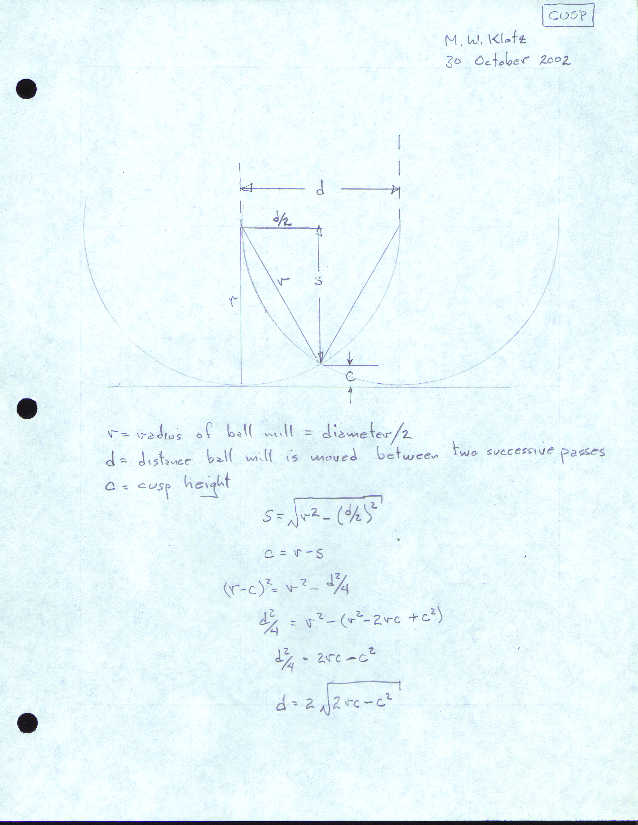

# cusp

Pass spacing for a ball end mill to limit cusp height.

**Converted from:** `CUSP.C` (M. W. Klotz, 10/02),
`MWKC/WorkshopUtilities/cusp.zip`
**Go source:** `MWKGo/cusp/cusp.go`

## Purpose

Written for Kevin Van de Velde, who wanted to mill a flat
surface with a ball end mill as a CNC exercise and needed to
know how far apart to space successive passes without leaving
too tall a ridge, or "cusp", between them. Given the ball mill's
diameter and the desired cusp height, this program computes the
spacing between passes.

## Inputs

| Prompt | Default |
|---|---|
| Ball mill diameter | 0.25 in |
| Desired cusp height | 0.001 in |

## Output

Spacing between successive passes.

## Method

This is the standard circular segment sagitta-to-chord
relationship: for a circle of radius r, a sagitta (cusp height)
of c corresponds to a chord (pass spacing) of:

```
spacing = 2 * sqrt(2*r*c - c^2)
```

A cusp height greater than the mill's radius is not physically
achievable with a ball profile; the original program does not
guard against this, and neither does the conversion, so the
result becomes undefined (`NaN`) rather than a silently wrong
number.

## Geometry



## Worked Example

No worked numeric example was included with the original
program, only the diagram above. As an independently verifiable
check: a cusp height equal to the mill's radius means the pass
removes exactly a semicircle, whose chord is the full mill
diameter.
